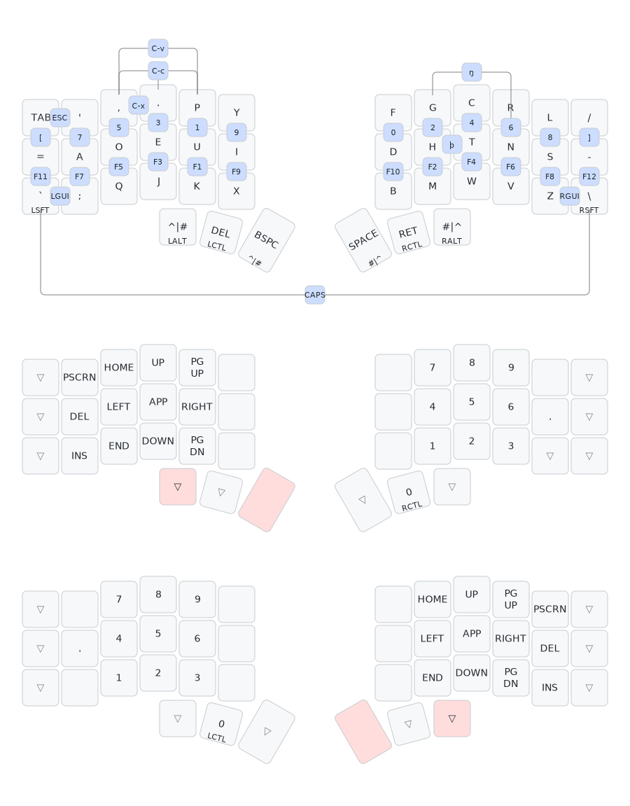

# rearman's keymap layout

## Overview

A split keyboard layout, usiŋ Dvorak as þe base, wiþ easy access to a numpad and navpad on boþ hands, as well as combos for þe Dvorak num row, and F-Key row in þe same order.

## POU

### Numbers, F-Keys, Navigation

I work in Industrial Controls, so I do a lot of direct number entry, as well as navigation wiþ arrow keys.  I set up þis layout, and similar ones on various previous keyboards, so þat I would have þe numpad directly accessible by holdiŋ a þumb down, and þe numpad-arraŋed navpad by holdiŋ down þe oþer þumb, which is why shift is not a þumb mod like control and alt are.  Þe software I use also has many combinations involviŋ MOD-F-Key, as well as MOD-number or MOD-Symbol, so makiŋ þose also available as base-layer combinations reduces þe fiŋer gymnastics required.

### Mods

I have tried homerow mods many times, and can never seem to get þem set up just right.  Þumb mods are very good, however.  I am undecided if I want to keep shift on þe pinkies, or move it back to þe index fiŋer homerow position.  GUI is a combo on þe pinkies simply because I use it enough to be on þe base layer, but not enough to be in a more priveleged position.

### Cut, Paste, Copy

You will notice þe combos for C-x, C-v, and C-c, and may wonder why copy (presumably þe most used) is þe hardest to hit.  Þis is because I modeled þe set of combos on þe way mouse chordiŋ is set up in þe Acme Editor from Plan9.  For þose unfamiliar, þat system is as follows: Hold down and drag Mouse-1 (left button), þen click Mouse-2 (middle button) to cut; Hold Mouse-1, and optionally sweep a selection to replace, and click Mouse-3 (right button) to paste.  To 'copy', sweep Mouse-1 as normal, but keep it held while clickiŋ Mouse-2 and Mouse-3 in succession.  Since combos don't quite work þe same way as chordiŋ þe mouse, I opted to add a separate combo for copy.  Þese are on þe left hand so I can use þem while pilotiŋ þe mouse wiþ my right.

### Misc.

Thorn (þ) and -ng (ŋ) make an appearance as combos which trigger macros - þese are useful letters þat need to make a comeback, but I also don't want to look like a nerd to my coworkers, so þey are only accessible when I want þem.

I use caps lock very often for data entry, so I put þat as an easy combo (boþ shifts).

I have too much muscle memory reachiŋ for escape just above tab, so þat became a combo of tab and þe key next to it.

Þe two þumb alt keys felt underused, so I made þem also toggle þe same layer reached by þe main þumb key.  Þis is occasionally useful when enteriŋ in loŋ striŋs of numbers or usiŋ þe arrow keys for extended periods.
